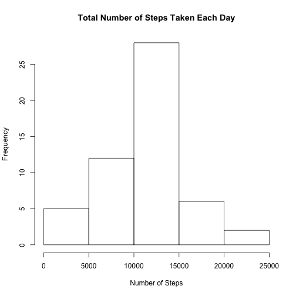
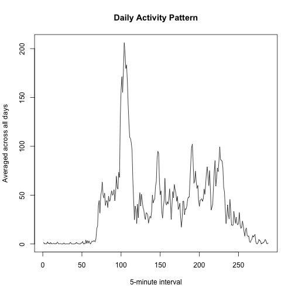
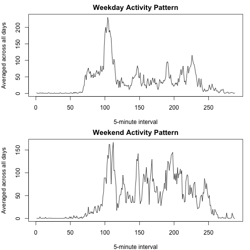

Reproducible Research Assignment 1
==================================

First, let's read the data into R, and remove NAs.


```r
setwd("/Users/ymin/Documents/Coursera/Reproducible_Research")
act <- read.csv(file = "activity.csv", header = TRUE, sep = ",")
actRm <- na.omit(act)
```

Then transform dataset "act"'s "date" variable into dates.
Sum steps taken each day.


```r
actRm$date <- as.Date(actRm$date, "%Y-%m-%d" )
actSum <- aggregate(steps ~ date, actRm, sum)
```


Now, let's make a histogram of the total number of the steps taken each day.


```r
hist(actSum$steps, main = "Total Number of Steps Taken Each Day", xlab = "Number of Steps")
```



Next, calculate the mean and median of the steps taken each day.


```r
mean(actSum$steps)
```

```
## [1] 10766.19
```

```r
median(actSum$steps)
```

```
## [1] 10765
```

What is the average daily activity pattern?


```r
actMean <- tapply(actRm$steps, actRm$interval, mean)
plot(actMean, type = "l", xlab = "5-minute interval", ylab = "Averaged across all days", main = "Daily Activity Pattern")
```



The 5-minute interval that, on average, contains the maximum number of steps?


```r
max(actMean)
```

```
## [1] 206.1698
```

Let's calculate the number of missing values.


```r
sum(is.na(act$steps))
```

```
## [1] 2304
```

Create a new dataset, and replace the missing value with daily mean.


```r
actNew <- act
na <- is.na(actNew$steps)
actNew$steps[na] <- actMean[as.character(actNew$interval[na])]
```

Make a histogram of the total number of steps taken each day.
Calculate and report the mean and median total number of steps taken per day.


```r
actNew$date <- as.Date(act$date, "%Y-%m-%d")
actNewSum <- aggregate(steps ~ date, actNew, sum)
mean(actNewSum$steps)
```

```
## [1] 10766.19
```

```r
median(actNewSum$steps)
```

```
## [1] 10766.19
```

The impact of imputing missing value is that the mean and the median become the same value. 

Create a new factor variable with two levels – “weekday” and “weekend”


```r
actNew$weekday <- weekdays(actNew$date)
actNew$week <- as.factor(c("weekday", "weekend"))
actNew[actNew$weekday == "Saturday" | actNew$weekday == "Sunday", 5] <- factor("weekend")
actNew[!(actNew$weekday == "Saturday" | actNew$weekday == "Sunday"), 5] <- factor("weekday")
```

Calculate average steps taken on weekdays and weekends by 5-min interval


```r
WD <- subset(actNew, week == "weekday",)
WE <- subset(actNew, week == "weekend",)
WDMean <- tapply(WD$steps, WD$interval, mean)
WEMean <- tapply(WE$steps, WE$interval, mean)
```

Plot weekday and weekend average steps.


```r
par(mfrow = c(2,1), mar = c(4,4,2,1))
plot(WDMean, type = "l", xlab = "5-minute interval", ylab = "Averaged across all days", main = "Weekday Activity Pattern")
plot(WEMean, type = "l", xlab = "5-minute interval", ylab = "Averaged across all days", main = "Weekend Activity Pattern")
```




